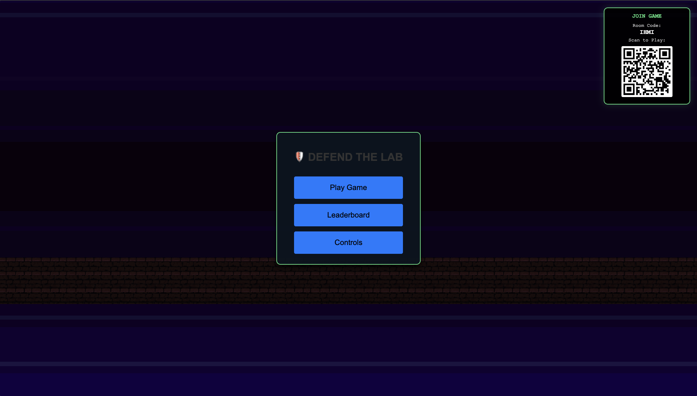
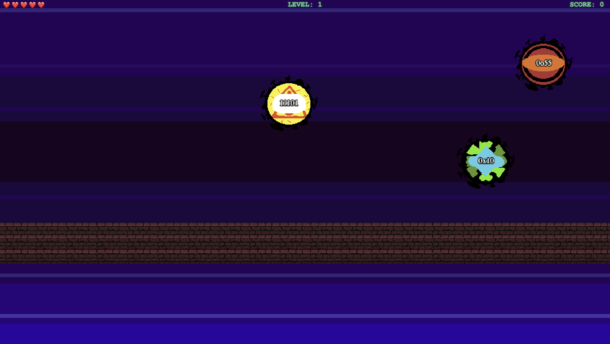
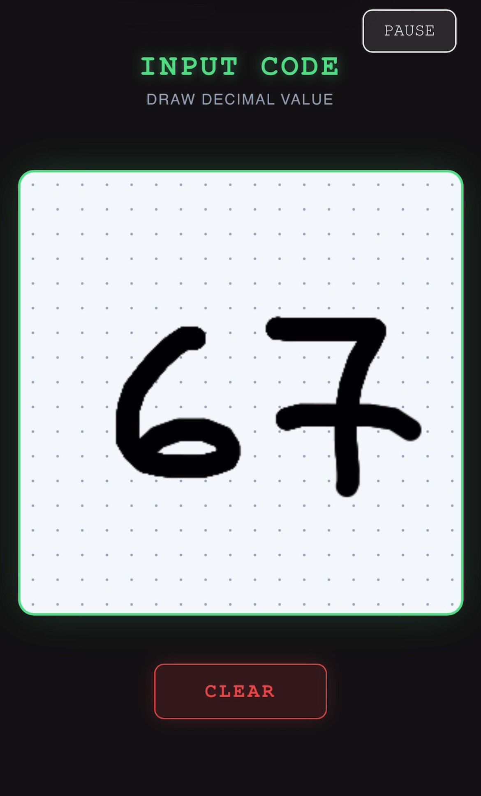
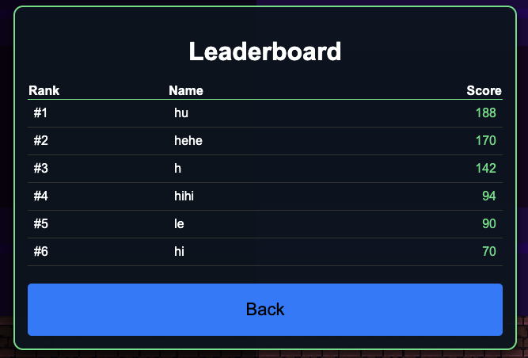
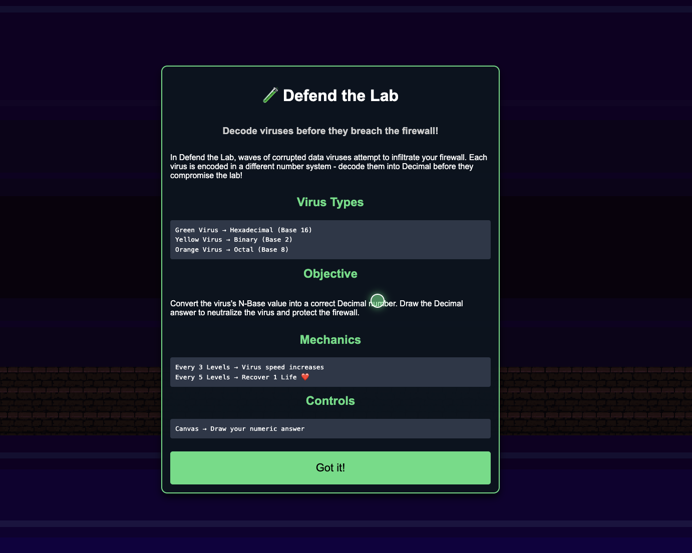

# Defend the Lab

**Defend the Lab** is an interactive computational game where you play as a cybersecurity admin defending a high-security facility from digital threats.

## 🛡️ What it Does

You are the last line of defense for a lab holding critical national secrets. Dangerous viruses—encoded in **Decimal**, **Binary**, and **Octal** formats—are attempting to breach the firewall.

Your mission is to **decode** these viruses by translating their values into decimal numbers using your controller. Correctly identifying the threat neutralizes the virus before it can penetrate the system.

### 🖥️ Kiosk Display
| Initial Menu | Core Gameplay |
| :---: | :---: |
|  |  |

### 📱 Mobile Controller
| Navigation Mode | Drawing Mode |
| :---: | :---: |
|  |  |

### 🏆 Leaderboard
<div align="center">
  
  <br>
  <em>Global Leaderboard tracking top lab defenders.</em>
</div>

---

## 🚀 Install & Run

> **Important:** The Node.js server (Game Hub) and the Python server (AI Model) **must run on the same computer**.

### 1. Environment Setup
Create a `.env` file in the root directory (`my-webtouch-app/`) to configure your database and server port.

```env
MONGO_URI=mongodb+srv://<username>:<password>@cluster0.mongodb.net/defend-the-lab?retryWrites=true&w=majority
PORT=3000
```

### 2. Python Backend (AI Model)
The game uses a Python Flask server to process handwriting recognition.

1.  **Navigate to the source directory:**
    ```bash
    cd src
    ```

2.  **Set up a Virtual Environment (Optional but Recommended):**
    ```bash
    python -m venv venv
    source venv/bin/activate  # On Windows: venv\Scripts\activate
    ```

3.  **Install Dependencies:**
    ```bash
    pip install -r requirements.txt
    ```

4.  **Start the Python Server:**
    ```bash
    python app.py
    ```
    *Runs on `http://0.0.0.0:5000`*

### 3. Node.js Server (Game Hub)
1.  **Return to the root directory:**
    ```bash
    cd ..
    ```

2.  **Install Dependencies:**
    ```bash
    npm install
    ```

3.  **Start the Game Server:**
    ```bash
    npm run dev
    ```
    *Runs on `http://localhost:3000`*

---
## 🎮 How to Play

1.  **Ensure both servers are running** (Python on port 5000, Node on port 3000).
2.  **Open the Game Kiosk**:
    *   The game should automatically open in your browser at `http://localhost:3000`.
3.  **Connect Your Controller**:
    *   Ensure your **Phone** and **Computer** are on the **same Wi-Fi network**.
    *   Scan the **QR Code** displayed on the game screen with your phone.
    *   Your phone will transform into a writing pad.
4.  **Defend!**:
    *   Read the number on the virus (Binary, Octal, or Hex).
    *   Convert it to **Decimal**.
    *   Write the answer on your phone screen to destroy the virus!
    
*Controls of the Game*

---

## 📂 Project Structure

The project follows a "Thick-Server" architecture. The **Phaser** game logic is located in `src/game_logic/`.

```text
my-webtouch-app/
├── docs/               # Documentation and media assets
├── models/             # Mongoose database models (Player.js)
├── public/             # Frontend entry points
│   ├── app.html        # Main Game Kiosk
│   ├── controller.html # Mobile Controller
│   └── js/             # Client-side logic
├── src/                # Game Source Code
│   ├── app.py          # Python Flask Server (AI Model)
│   ├── ocr.py          # OCR Logic
│   ├── requirements.txt # Python Dependencies
│   ├── game_logic/     # Phaser Game Engine Logic
│   │   ├── game.js     # Game Config
│   │   ├── world/      # World Scene
│   │   ├── virus/      # Virus Logic
│   │   └── wall/       # Wall Logic
│   ├── model/          # AI Models (MobileNET)
│   ├── styles/         # CSS Styles
│   └── utils/          # Helper Scripts (Menus, etc.)
├── server.js           # Node.js Express Server (Game Hub)
├── package.json        # Node.js Dependencies
└── README.md           # Project Documentation
```

## ⚙️ Tech Stack

*   **Node.js & Express**: Central Game Hub.
*   **MongoDB Atlas**: Leaderboard persistence.
*   **Python Flask**: AI Character Recognition.
*   **Phaser 3**: Game Engine (located in `src/game_logic/`).
*   **WebTouch SDK**: Real-time controller-kiosk communication.

